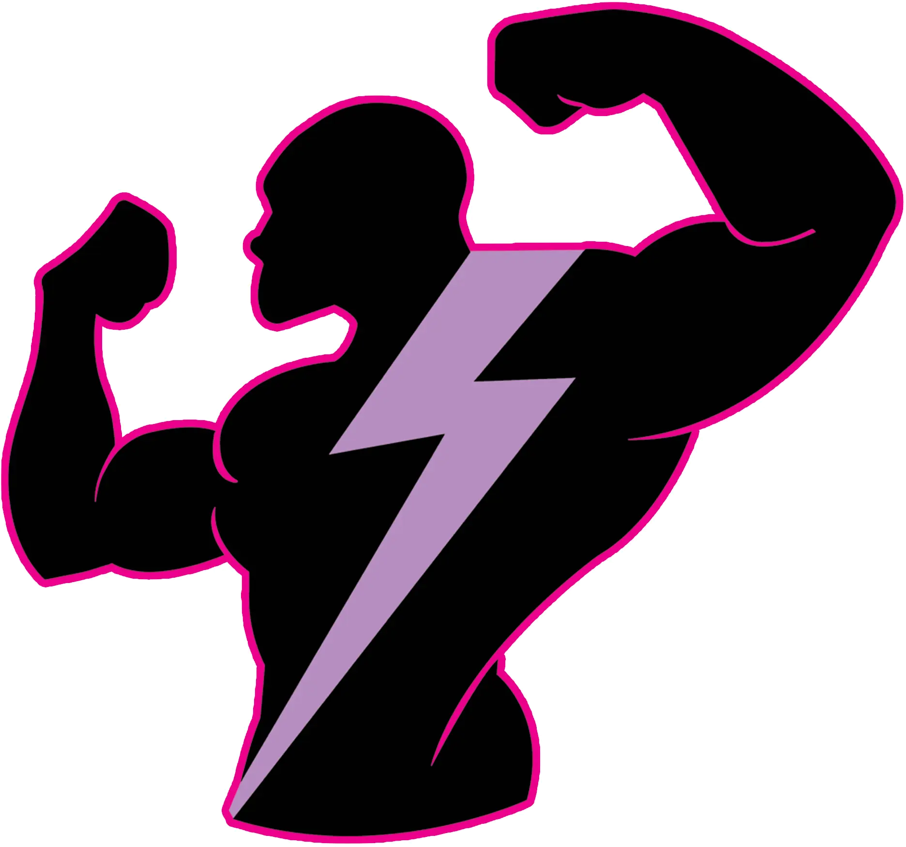

<p align="center">
  
</p>

<h1 align="center">SmartGym Enterprise</h1>
<h3 align="center">Custom Gym Management & Automated Smart Access Control Platform</h3>
<p align="center">
  <em>Client Deployment Case Study: <strong>Body Spark Fitness Club</strong></em><br />
  <em>Architected & Engineered by <strong>Hammad Shaikh</strong></em>
</p>

<p align="center">
  
  
  
  
  
  
</p>

---

## 📌 Project Overview

**SmartGym Enterprise** is a comprehensive, modular management and automated access control suite designed for commercial gyms, fitness centers, martial arts dojos, and health clubs. 

Originally engineered and deployed as a dedicated workstation for **Body Spark Gym**, this platform is built with an extensible, modular architecture that allows it to be customized and expanded with any feature, hardware integration, or workflow a gym requires.

Unlike generic subscription-based gym software that stops working when the internet cuts out, this platform operates on an **autonomous hybrid engine**: running lightning-fast locally with zero downtime while automatically synchronizing backups to Google Drive and multi-computer LAN workstations.

> 💡 **Need a custom system for your gym?**  
> This platform can be customized, branded with your gym's logo and color palette, and deployed with any hardware (fingerprint, Face ID, turnstiles, RFID) and software modules your business needs.  
> 👉 [Contact Hammad Shaikh for Custom Development](#-hire--custom-development-inquiries)

---

## 🚀 Core Features & Real-World Implementation

### 1. 🖲️ Smart Biometric & Hardware Access Control
- **Universal Hardware Bridge**: Socket integration with biometric devices (ZKTeco K50, Anviz, Suprema, etc.), RFID card readers, and turnstile gate relays over local network or direct cable.
- **Sub-Second Access Decision**: Checks member status, shift timing, and fee validity instantly on scan.
- **Auditory Verification Alerts**:
  - 🔔 *Success Chime*: Pleasant two-tone chime welcoming active, paid members.
  - 🚨 *Access Denied Buzzer*: High-visibility alert sound stopping expired/unpaid entry attempts.
- **Fail-Safe Offline Mode**: Continues scanning and logging check-ins even if the internet is disconnected.

### 2. 👥 Full Member Lifecycle & Shift Management
- **Shift Scheduling**: Dedicated separation for Morning, Evening, and Night workout slots.
- **Membership Tiers**: Flexible packages (Monthly, 3 Months, 6 Months, Yearly, Drop-in Day Passes).
- **Automated Expiration Engine**: Daily automated overdue status calculations and automated fee adjustments.
- **Biometric Slot Enrollment**: In-app fingerprint registration directly linked to member profiles.

### 3. 📊 Financial Accounting, Expenses & P&L Analytics
- **Live Revenue Tracking**: Automatic digital receipt logging on every membership renewal or registration.
- **Operating Expense Manager**: Categorized cost logging for:
  - 🏢 Facility Rent
  - ⚡ Electricity & Utility Bills
  - 👥 Staff & Trainer Salaries
  - 🏋️ Equipment Maintenance & Upgrades
  - 💊 Supplements & Refreshment Stock
  - 📢 Marketing & Daily Operations
- **Interactive Monthly Filter**: 1-click monthly breakdown displaying:
  $$\text{Net Profit} = \text{Gross Fee Revenue} - \text{Total Operational Expenses}$$

### 4. ☁️ Autonomous Google Drive Cloud Sync & 1-Click Laptop Migration
- **Weekly Auto-Sync**: Automatically pushes encrypted, transaction-safe database snapshots to your connected Google Drive once a week.
- **Zero-Config Webhook**: Simple 1-minute setup via Google Apps Script — no complicated APIs or expiring tokens.
- **1-Click Restore**: Installing on a new laptop? Download your latest `.bsbak` backup file from Google Drive, select it in the app, and import all member profiles, fingerprint records, financial receipts, and attendance history in seconds.
- **Pre-Restore Rollback Guard**: Preserves a local safety copy before any database import to ensure zero data loss.

### 5. 🛡️ Enterprise Security & Two-Factor Authentication (2FA)
- **Google Authenticator (RFC 6238 TOTP) Protected Setup**: Workstation installer is locked by dynamic 6-digit smartphone authentication codes.
- **Terminal Admin Locks**: Prevent unauthorized staff from altering fees, deleting member accounts, or modifying financial books.
- **Sanitized Distribution**: New installations initialize clean slate databases without lingering test records.

---

## 🧩 Modular Extensions & Available Add-Ons

The platform is designed with a plugin-style architecture. Any of the following modules can be activated or custom-built for gym clients:

| Module | Features & Capabilities |
| :--- | :--- |
| **📱 WhatsApp & SMS Gateway** | Automated fee reminders, expiry alerts, and digital payment receipts sent directly to members' WhatsApp or mobile phones. |
| **🚪 Turnstile & Magnetic Door Locks** | Electronic relay trigger to unlock gym entry turnstiles, speed gates, or magnetic glass doors upon valid scan. |
| **📸 Face Recognition & Thermal** | Contactless AI facial recognition terminals for high-throughput gym entrances. |
| **🛒 Gym Supplement POS** | Point-of-Sale barcode scanner module for protein supplements, energy drinks, gym apparel, and snacks. |
| **📅 Personal Trainer & Class Booking** | Trainer commission tracking, personal training session cards, and group class capacity reservations. |
| **🌐 Multi-Branch Chain Network** | Cloud centralized database allowing members to scan in across multiple gym branches with centralized owner reporting. |
| **📱 Member Mobile App (iOS / Android)** | Branded mobile app for gym members to view workout logs, track fee due dates, and scan dynamic QR codes for entry. |

---

## 🏛️ System Architecture

```
┌────────────────────────────────────────────────────────────────────────┐
│                        SMARTGYM WORKSTATION OS                         │
├───────────────────────────┬────────────────────────────────────────────┤
│   React 19 Desktop Client │   High-Throughput Local Server Core        │
│   • Frameless Native Shell│   • Node.js Event Loop Architecture        │
│   • Dark & Light Modes    │   • SQLite Engine in WAL Journal Mode      │
│   • Instant Search Engine │   • Hardware TCP/IP Session Supervisor     │
│   • P&L Financial Engine  │   • Multi-PC LAN Network Bridge            │
└─────────────┬─────────────┴─────────────────────┬──────────────────────┘
              │                                   │
              ▼                                   ▼
┌───────────────────────────┐       ┌────────────────────────────────────┐
│   Hardware & Access Layer │       │    Cloud Redundancy & Messaging    │
│   • ZKTeco / Biometrics   │       │    • Weekly Google Drive Snapshots │
│   • Turnstiles & Relays   │       │    • WhatsApp / SMS Gateway Ready  │
│   • RFID / Face ID / QR   │       │    • 1-Click Multi-PC Provisioning │
└───────────────────────────┘       └────────────────────────────────────┘
```

---

## 🛠️ Technology Stack

| Layer | Technology | Details |
| :--- | :--- | :--- |
| **Client UI** | React 19, Vite, Vanilla CSS | Ultra-responsive, smooth dark/light design system with zero browser chrome |
| **Backend Core** | Node.js, Express | Event-driven micro-server with Server-Sent Events (SSE) live telemetry |
| **Database** | SQLite 3 (WAL Mode) | Transactional ACID database with zero external server dependencies |
| **Hardware Driver** | Binary TCP/IP Socket Protocol | Low-level direct socket protocol for biometric and RFID devices |
| **Desktop Shell** | C# .NET Windows Forms | Dedicated borderless desktop window with Windows System Tray minimization |
| **Cloud Bridge** | Google Apps Script Webhook | Serverless Google Drive storage bridge using Base64 octet streams |
| **Security** | RFC 6238 TOTP (SHA-1) | Dynamic 2FA authentication algorithm for software installer protection |

---

## 🏆 Client Case Study: Body Spark Gym

> *"Body Spark Gym needed a robust workstation software to replace manual paper registers and eliminate unauthorized member entry during busy morning and evening rush hours. The solution needed to operate reliably without relying on an active internet connection, enforce membership due dates with clear auditory alerts, track daily overhead expenses, and provide automated off-site backups."*

**Delivered Solution**:
- Custom-branded standalone desktop application with Body Spark's official emblem and theme.
- Direct-cable ZKTeco K50 biometric check-in with high-volume alarm for unpaid members.
- Instant Monthly Financial P&L filter for business owners.
- Autonomous weekly backup to Google Drive.

---

## 💼 Hire / Custom Development Inquiries

Are you looking for a **custom gym management system**, **biometric hardware integration**, **turnstile access control**, or **tailored fitness software** for your gym or club?

I engineer end-to-end commercial desktop and cloud solutions tailored to your exact business rules:
- **Custom Branding & UI Design** matching your gym's brand identity.
- **Hardware Integration** (ZKTeco, RFID, Turnstiles, Face ID, Fingerprint).
- **Custom Features** (WhatsApp notifications, supplement POS, multi-branch syncing).
- **Turnkey Setup & Remote Installation**.

### Contact Information:
- **Developer**: Hammad Shaikh
- **GitHub**: [@Hammadshaikh1994](https://github.com/Hammadshaikh1994)
- **Email**: [hammadshk1994@gmail.com](mailto:hammadshk1994@gmail.com)
- **Profile**: [github.com/Hammadshaikh1994](https://github.com/Hammadshaikh1994)

---

## 📄 Proprietary Notice & Copyright

Copyright © 2026 **Hammad Shaikh**. All rights reserved.

*Notice: This repository serves as a public architectural showcase and technical portfolio. Core proprietary backend algorithms, biometric firmware communication drivers, and commercial database binaries are maintained in private development repositories. Commercial licenses and customized builds are available upon request.*
